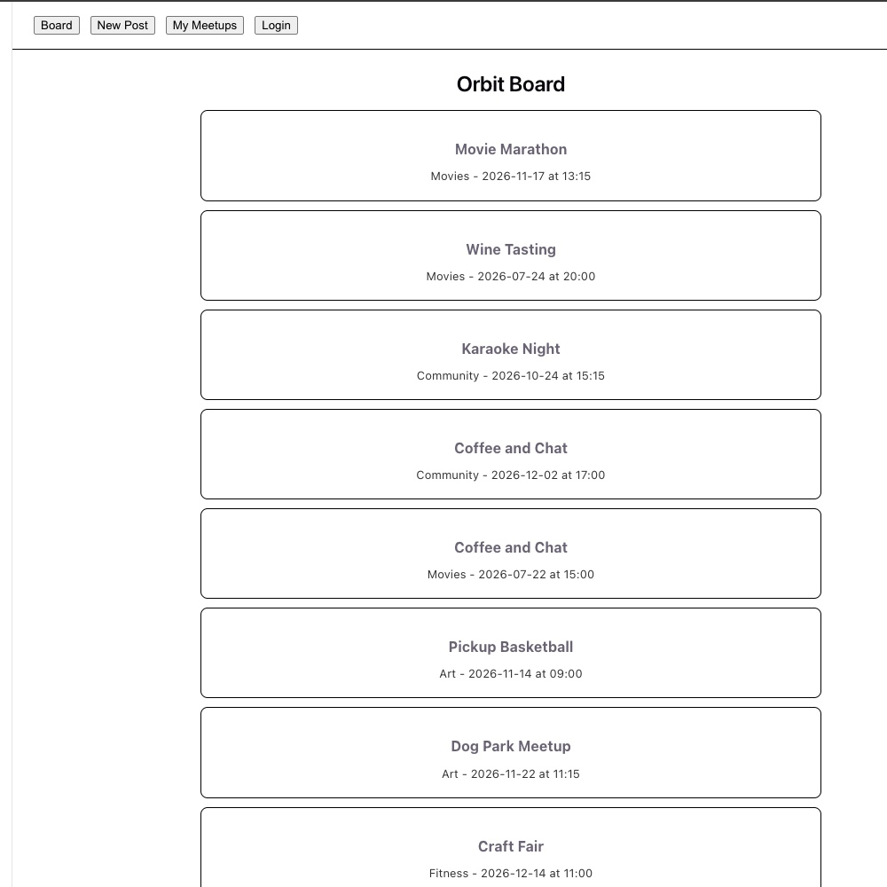
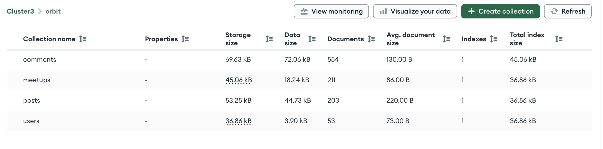

# Orbit

Peer Review by Melissa - Hi Nat! Awesome job on this project, I thought this idea was very creative and addresses an issue many of us have experienced. You did a great job on utilizing React components and implementing authorization. If you were to continue this project in the future, I would say it would be helpful to make sure you have to be logged in in order to create a post. Also, I would make the titles for Login/Sign-in darker so its easier to see. The app name/logo at the top would be a nice touch too! 

## Author

Nathalie Cabrera and Alex Perkins

## Class Link

[CS5610 Web Development — Northeastern University, Roux Institute](https://johnguerra.co/classes/webDevelopment_online_summer_2026/)

## Youtube/video link

[cs5610project3](https://www.youtube.com/watch?v=NklyXs0YQKQ)

## Project Objective

Orbit is a full-stack web app that helps people turn shared interests into real plans. Users post an activity with a required date and time, others comment to discuss it, and anyone can click "I'm in" to join. It solves a common problem — loose plans made in group chats or on social media that fizzle out because there's no clear way to see who's actually committed.

## Demo

https://youtu.be/TAPi6jtuocw

## Google Slides

https://docs.google.com/presentation/d/1BZEdPJNKcdkM_RK4LiGAiDsWKhxW1PIBvS9okSnRxPI/edit?usp=sharing

## Screenshot




## Instructions to Build

### Prerequisites

- Node.js (v20+)
- A MongoDB Atlas cluster (or local MongoDB instance)

### Backend Setup

```bash
cd backend
npm install
```

Create a `.env` file in `backend/` with:
MONGODB_URI=your_atlas_connection_string
SESSION_SECRET=your_secret_key

### Run the Backend

```bash
npm start
```

### Frontend Setup

```bash
cd ../frontend
npm install
npm run dev
```

### Deployment

The app is deployed at: https://orbit-backend-5uvw.onrender.com/
